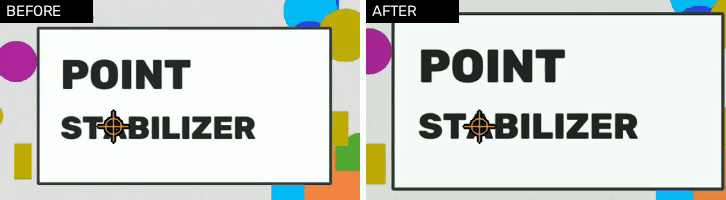

# Point Stabilizer

**Стабилизация видео по точке.** Выбираете неподвижную деталь на первом кадре (или даёте программе
выбрать самой), и каждый кадр сдвигается так, чтобы эта деталь стояла ровно на месте. Потом картинка
приближается ровно настолько, чтобы не было чёрных краёв. Звук сохраняется.



*Слева: искусственная тряска руки. Справа: зафиксировано по перекрестию. Ролик пересоздаёт
[`docs/make_demo.py`](docs/make_demo.py).*

На тестовом ролике с тряской до ±29 px выбранная деталь гуляла **в среднем на 20 px до и на 0.03 px после**
(ширина 1280 px, 240 кадров, ни один кадр не потерян).

[English version](README.md)

## Как пользоваться

```bash
pip install -r requirements.txt      # opencv-python, numpy
python stabilize.py video.mp4
```

Откроется окно с первым кадром. **Кликните по неподвижной детали и нажмите Enter**, либо просто нажмите
Enter, чтобы принять зелёную подсказку. Esc отменяет. Результат сохраняется рядом с видео как
`video_stabilized.mp4`, с исходным звуком.

Ещё нужен **ffmpeg** (`brew install ffmpeg`, `winget install ffmpeg`, `apt install ffmpeg`). Без него
программа работает, но без звука и с более простым кодировщиком.

| Параметр | Что делает |
|---|---|
| `--point auto` | без окна: программа сама выбирает неподвижную деталь |
| `--point X,Y` | без окна: зафиксировать этот пиксель первого кадра |
| `--zoom auto` (по умолчанию) | приблизить ровно настолько, чтобы не было чёрных краёв; `--zoom 1.15` задаёт вручную, `--zoom 1` выключает |
| `--border black\|replicate\|reflect` | чем заполнять края, когда приближение выключено |
| `--crf 18` | качество видео (меньше значит лучше и тяжелее) |
| `--preview` | показывать кадры и полосу прогресса в окне |
| `-o out.mp4` | куда сохранить |

Если запустить без указания видео (например, как готовое приложение), оно само спросит файл, покажет
прогресс в окне и покажет результат в Finder / Проводнике.

## Что выбирать за точку

Берите то, что **неподвижно в реальности**, **чёткое**, **контрастное** и **видно весь ролик**: угол окна,
край стола, табличка на стене. Не человека, не руки, не небо и не ровную стену. Окно скажет, если вы
кликнули в слабое место, а зелёные метки — это детали, которые программа нашла и которые точно
повторяют движение камеры.

## Как это устроено

1. **Слежение.** Пирамидальный оптический поток Лукаса-Канаде (`cv2.calcOpticalFlowPyrLK`) ведёт точку от
   кадра к кадру, обратная проверка замечает, когда она соскальзывает.
2. **Потеря точки.** Если трек потерян (смаз, вспышка, что-то прошло поверх), позиция удерживается, а точка
   ищется заново рядом с прежним местом: сначала по внешнему виду (шаблон с первого кадра, уточнение до
   долей пикселя и проверка геометрии); если не находится 12 кадров, рядом засеваются новые углы, и позиция
   продолжается по их движению без скачка.
3. **Приближение.** Видео обрабатывается за два прохода: первый ведёт точку по всему ролику, затем
   считается наименьшее постоянное приближение, при котором каждый кадр закрывает рамку (не больше 1.6×).
4. **Подсказки.** Углы в первых секундах отслеживаются и подгоняются под одну модель камеры (сдвиг,
   поворот, масштаб, устойчиво к выбросам); те, что остаются на ней, и есть неподвижные предметы.
5. **Выход.** Кадры идут в ffmpeg (H.264), исходный звук подмешивается; картинку никогда не режет из-за
   того, что звук чуть короче.

## Ограничения

- Исправляется только **сдвиг**, не поворот и не зум камеры.
- Одна точка, выбранная на **первом кадре**. Если нужное появляется позже, обрежьте начало.
- Крупный объект, проехавший по точке, может на несколько кадров увести трек. В тесте было до ~48 px на
  4 кадра; как только точка снова видна, она находится.
- В роликах, где сама камера едет, или смонтированных с монтажными склейками и анимированными зумами,
  неподвижных деталей нет: `--point auto` скажет об этом, и тогда кликайте вручную.
- Проверено на OpenCV 4.14 и 5.0 на macOS (Apple Silicon). CI дополнительно запускает Linux и Windows.

## Использование из Claude Code или Codex

Репозиторий это ещё и *навык для агентов*. Поставьте его и попросите агента, например, «стабилизируй
`reel.mp4`»: он откроет окно у вас на экране, вы кликнете точку, а остальное он сделает сам.

```bash
npx skills add oknehcvark/point-stabilizer
```

Навык лежит в [`skills/point-stabilizer`](skills/point-stabilizer/SKILL.md); [`AGENTS.md`](AGENTS.md) для
агентов, работающих внутри этого репозитория. Чтобы открыть окно, агент должен работать на вашем
компьютере; на удалённой машине он использует `--point auto` или координаты.

## Собрать приложение для macOS самому

```bash
pip install pyinstaller imageio-ffmpeg opencv-python numpy
FFMPEG=$(python -c "import imageio_ffmpeg; print(imageio_ffmpeg.get_ffmpeg_exe())")
cp "$FFMPEG" ./ffmpeg
pyinstaller --windowed --name "Point Stabilizer" --add-binary "./ffmpeg:." \
  --exclude-module tkinter skills/point-stabilizer/scripts/stabilize.py
```

Приложение появится в `dist/` и не требует установленных Python и ffmpeg.

## Тесты

```bash
pip install -r requirements.txt pytest
pytest -q
```

Тесты строят в памяти искусственные трясущиеся сцены (вспышка, смаз, рывок) и проверяют точность до долей
пикселя, восстановление после потери, что приближение закрывает все края и что подсказанные точки
действительно неподвижны.

## Лицензия

[MIT](LICENSE). Требуются OpenCV (Apache-2.0), NumPy (BSD) и бинарник FFmpeg (LGPL или GPL в зависимости от
сборки; в этот репозиторий он не входит). Готовое приложение со вшитой сборкой FFmpeg с x264 распространяется
на условиях GPL этой сборки.
